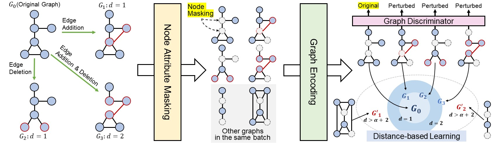

# Graph Self-supervised Learning with Accurate Discrepancy Learning

Official Code Repository for the paper "Graph Self-supervised Learning with Accurate Discrepancy Learning" (NeurIPS 2022): https://arxiv.org/abs/2202.02989

In this repository, we implement *Discrepancy-based graph Self-supervised LeArning* (D-SLA).

<p align="center">
    
</p>


## Contribution

* We propose a novel graph self-supervised learning framework with a completely opposite objective from contrastive learning, which aims to learn to differentiate a graph and its perturbed ones using a discriminator, as even slight perturbations could lead to completely different properties for graphs. 
* Utilizing the graph edit distance that is obtained for perturbed graphs at no cost, we propose a novel objective to preserve the exact amount of discrepancy between graphs in the representation space.
* We validate our D-SLA by pre-training and fine-tuning it on various benchmarks of chemical, biology, and social domains, on which it significantly outperforms baselines.


## Dependencies
```
python 3.8 
pytroch 1.7.0
torch-geometric 1.7.0
torch-cluster 1.5.9
torch-scatter 2.0.6
torch-sparse 0.6.9
torch-spline-conv 1.2.1
rdkit 2022.03.5
```


## Dataset
### 1. Molecular graph dataset
To download the molecular graph dataset, run commands below

```sh
wget http://snap.stanford.edu/gnn-pretrain/data/chem_dataset.zip
unzip chem_dataset.zip -d transferLearning_MoleculeNet_PPI/chem/
```


### 2. Biological graph dataset
To download the biological graph dataset, run commands below

```sh
wget http://snap.stanford.edu/gnn-pretrain/data/bio_dataset.zip
unzip bio_dataset.zip -d transferLearning_MoleculeNet_PPI/bio/
```


## Pre-training

### 1. Molecular graph dataset

```sh
cd transferLearning_MoleculeNet_PPI/chem

python pretrain_DSLA.py --edit_learn --add_strong_pert --margin_learn --margin {MARGIN} --lr {LR}
```

For example,
```sh
python pretrain_DSLA.py --edit_learn --add_strong_pert --margin_learn --margin 5.0 --lr 0.001
```

### 2. Biological graph dataset

```sh
cd transferLearning_MoleculeNet_PPI/bio

python pretrain_DSLA.py --edit_learn --add_strong_pert --margin_learn --margin 10.0 --lr 0.001
```

### 3. Social graph dataset
The pair of (*DATASET_NAME*, *PERTURBATION_STRENGTH*) is the one of (COLLAB, 0.001), (IMDB-BINARY, 0.01), (IMDB-MULTI, 0.01).
```sh
cd linkPrediction_TU

python pretrain_DSLA.py --dataset {DATASET_NAME} --edge_pert_strength {PERTURBATION_STRENGTH} --edit_learn
```

For example,
```sh
python pretrain_DSLA.py --dataset COLLAB --edge_pert_strength 0.001 --edit_learn
```


## Fine-tuning

### 1. Molecular graph dataset - Molecular property prediction
The downstream dataset is the one of [bbbp, clintox, muv, hiv, bace, sider, tox21, toxcast].

```sh
cd transferLearning_MoleculeNet_PPI/chem

python finetune.py --model_file {MODEL_FILE} --runseed {SEED} --dataset {DATASET_NAME} --lr 0.001
```

For example,
```sh
python finetune.py --model_file ckpts/DSLA/100.pth --runseed 0 --dataset bbbp --lr 0.001
```

### 2. Biological graph dataset - Protein function prediction

```sh
cd transferLearning_MoleculeNet_PPI/bio

python finetune.py --model_file {MODEL_FILE} --runseed {SEED} --lr 0.001
```

For example, 
```sh
python finetune.py --model_file ckpts/DSLA/100.pth --runseed 0 --lr 0.001
```

### 3. Social graph dataset - Link prediction
The dataset is the one of [COLLAB, IMDB-BINARY, IMDB-MULTI].

```sh
cd linkPrediction_TU

python finetune_edgepred.py --dataset {DATASET_NAME} --model_file {MODEL_FILE} --seed {SEED}
```

For example,
```sh
python finetune_edgepred.py --dataset COLLAB --model_file ckpts/COLLAB/DSLA/100.pth --seed 0
```


## Citation
```
@article{kim2022dsla,
  author    = {Dongki Kim and
               Jinheon Baek and
               Sung Ju Hwang},
  title     = {Graph Self-supervised Learning with Accurate Discrepancy Learning},
  journal   = {arXiv:2202.02989},
  year      = {2022},
  url       = {https://arxiv.org/abs/2202.02989}
}
```
